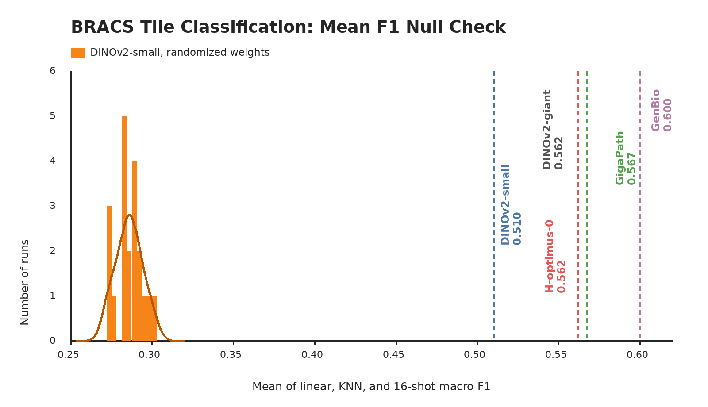

# BRACS

## Role In Nanopath

`bracs` is a breast ROI classification probe. It contributes one scalar to `mean_probe_score`: the mean of linear, KNN, and 16-shot SimpleShot validation macro F1.

## Source

- Dataset: [BRACS](https://arxiv.org/abs/2111.04740) ROI release
- Benchmark family: [THUNDER](https://mics-lab.github.io/thunder/) tile-classification tasks (`linear_probing`, `knn`, `simple_shot`)
- Upstream source: `ftp://histoimage.na.icar.cnr.it/BRACS_RoI/`
- Download used by `prepare.py`: `medarc/nanopath`, under `probes/bracs/`

## Split And Labels

BRACS is a breast carcinoma subtyping dataset for H&E whole-slide and ROI-level images. Nanopath uses only the ROI images and the checked-in split metadata in `bracs.json`, which mirrors the official BRACS `latest_version/{train,val,test}` folders.

| split | images |
|---|---:|
| train | 3657 |
| val | 312 |
| test | 570 |

Only train and val are read by `probe.py`. The seven labels follow the BRACS ROI folders:

| label id | folder | meaning |
|---:|---|---|
| 0 | `N` | normal |
| 1 | `PB` | pathologic benign |
| 2 | `UDH` | usual ductal hyperplasia |
| 3 | `FEA` | flat epithelial atypia |
| 4 | `ADH` | atypical ductal hyperplasia |
| 5 | `DCIS` | ductal carcinoma in situ |
| 6 | `IC` | invasive carcinoma |

## Implementation

The image adapter reads relative PNG paths from `benchmarking/bracs.json`. Trained Nanopath checkpoints use the square `Resize((224, 224))` default from `model.py::probe_transforms`; frozen baseline scripts set `probe.transform_policy`, with OpenMidnight also using THUNDER's square resize. Frozen embeddings are reused for:

- AdamW linear probe: LR ∈ {1e-3, 1e-4, 1e-5}, weight decay 1e-4, batch size 64, 200 epochs; report the best val macro F1 across all LR × epoch checkpoints
- cosine KNN: k ∈ {1, 3, 5, 10, 20, 30, 40, 50}, k selected by val F1
- SimpleShot few-shot: 1000 deterministic 16-shot support sets per class, support/query embeddings centered by each support-set mean, class prototypes from class-specific centered support means, cosine nearest-centroid prediction, then per-query majority vote

The dataset score is `mean(linear_val_f1, knn_val_f1, fewshot_val_f1)`. Macro F1 is important because the task is a seven-way lesion-subtype problem with clinically adjacent categories, not just normal-vs-cancer classification.

## Null Distribution Audit

`plot_null_checks.py` generates the figure above. The orange null is a fresh current-code rerun that constructs a new DINOv2-small with randomized weights for each seed before calling `probe.py`: mean 0.286, std 0.008, max 0.300. Fixed checkpoints are shown as vertical references: DINOv2-small 0.510, DINOv2-giant 0.562, GigaPath 0.567, GenBio-PathFM 0.600, and H-optimus-0 0.562.

This is a clean null check. Randomized DINOv2-small lands far below every fixed pretrained reference, so BRACS is not being propped up by random convolutional/ViT features or probe-head instability.

## Difference From Original Usage

BRACS has its own train/validation/test organization. Nanopath uses the same train and validation folders as the official release/THUNDER split metadata, but does not score the official test folder because the leaderboard is an iterative validation benchmark and should not consume official test labels. Interpret this probe as fine-grained breast ROI subtype recognition; large improvements are meaningful, but confusion among atypia/in-situ/invasive categories is expected and is exactly what macro F1 exposes.
