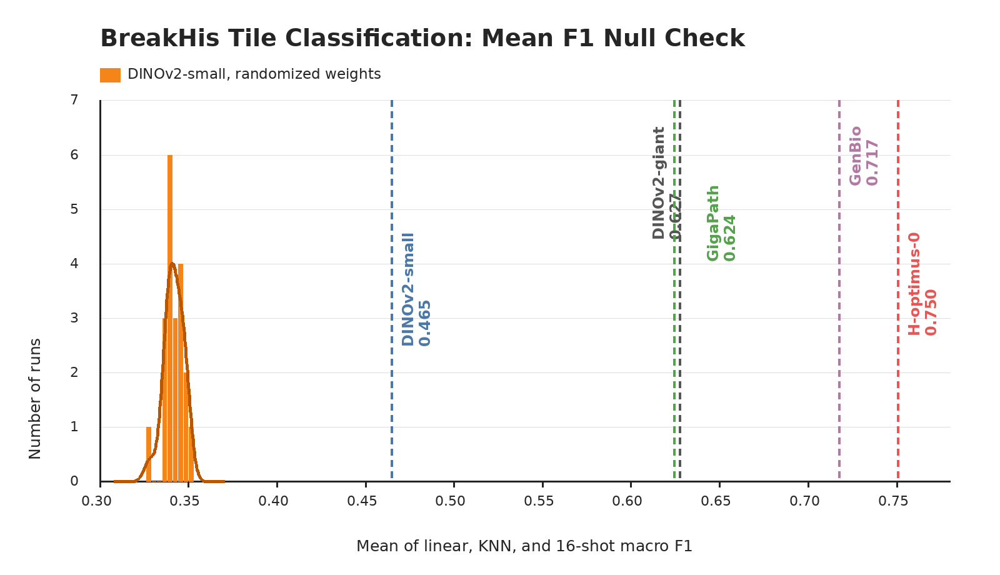

# BreaKHis

## Role In Nanopath

`break_his` is a breast histology image-classification probe. It contributes one scalar to `mean_probe_score`: the mean of linear, KNN, and 16-shot SimpleShot validation macro F1.

## Source

- Dataset: [BreaKHis](https://web.inf.ufpr.br/vri/databases/breast-cancer-histopathological-database-breakhis/)
- Upstream archive: `http://www.inf.ufpr.br/vri/databases/BreaKHis_v1.tar.gz`
- Download used by `prepare.py`: `medarc/nanopath`, under `probes/break_his/`
- Split provenance: [EVA](https://kaiko-ai.github.io/eva/main/datasets/breakhis/) / [THUNDER](https://mics-lab.github.io/thunder/) 40X four-subtype protocol

## Split And Labels

The full BreaKHis release contains breast tumor microscopy images from 82 patients at 40X, 100X, 200X, and 400X. Nanopath does not use the all-magnification or all-subtype task. It follows the EVA/THUNDER 40X four-subtype setup and uses the checked-in split metadata in `break_his.json`.

| split | images |
|---|---:|
| train | 936 |
| val | 196 |
| test | 339 |

| label id | class |
|---:|---|
| 0 | fibroadenoma |
| 1 | tubular adenoma |
| 2 | ductal carcinoma |
| 3 | mucinous carcinoma |

Only train and val are read by `probe.py`; the checked-in test split remains provenance metadata. Train, val, and test contain disjoint patient ids, which matters because BreaKHis has many related image captures per patient.

## Implementation

`probe.py` loads relative image paths from `benchmarking/break_his.json`, embeds each RGB image with Nanopath's default transform or the baseline script's explicit `probe.transform_policy`, and fits three heads on cached embeddings:

- AdamW linear probe: LR ∈ {1e-3, 1e-4, 1e-5}, weight decay 1e-4, batch size 64, 200 epochs; report the best val macro F1 across all LR × epoch checkpoints
- cosine KNN: k ∈ {1, 3, 5, 10, 20, 30, 40, 50}, k selected by val F1
- SimpleShot few-shot: 1000 deterministic 16-shot support sets per class, support/query embeddings centered by each support-set mean, class prototypes from class-specific centered support means, cosine nearest-centroid prediction, then per-query majority vote

The dataset score is `mean(linear_val_f1, knn_val_f1, fewshot_val_f1)`. Macro F1 is intentional here because the split is class-imbalanced, especially between ductal carcinoma and tubular adenoma.

## Null Distribution Audit

`plot_null_checks.py` generates the figure above. The orange null is a fresh current-code rerun that constructs a new DINOv2-small with randomized weights for each seed before calling `probe.py`: mean 0.342, std 0.005, max 0.350. Fixed checkpoints are shown as vertical references: DINOv2-small 0.465, DINOv2-giant 0.627, GigaPath 0.624, GenBio-PathFM 0.717, and H-optimus-0 0.750.

This is a clean null check. The randomized-weight distribution is tight and far below every pretrained reference, so BreaKHis is behaving like a useful representation probe rather than a probe-head or architecture artifact.

## Difference From Original Usage

BreaKHis should be read as a compact breast-subtype morphology probe, not as a full BreaKHis benchmark. It tests whether frozen features separate two benign and two malignant histologic patterns at 40X under a patient-disjoint split. It does not evaluate magnification invariance, binary benign/malignant diagnosis, patient-level aggregation, or the unused four BreaKHis subtypes.
