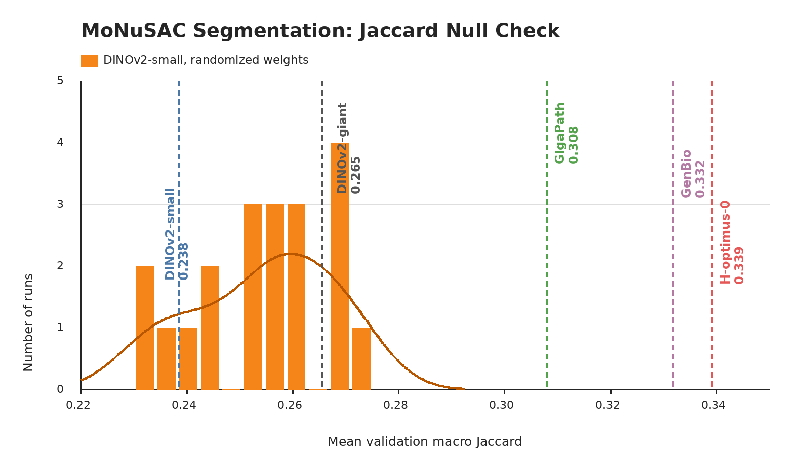

# MoNuSAC

## Role In Nanopath

`monusac` is a nucleus segmentation probe. It contributes one scalar to `mean_probe_score`: validation macro Jaccard.

## Source

- Dataset: [MoNuSAC 2020](https://research.rug.nl/en/publications/monusac2020-a-multi-organ-nuclei-segmentation-and-classification-) train images and annotations
- Download used by `prepare.py`: Google Drive file id `1lxMZaAPSpEHLSxGA9KKMt_r-4S8dwLhq`

## Split

MoNuSAC is a multi-organ nuclei segmentation and classification challenge dataset with annotations for epithelial cells, lymphocytes, macrophages, and neutrophils across lung, prostate, kidney, and breast tissue. Nanopath uses only the official train package. It creates deterministic 3-fold slide-disjoint validation splits with `SEG_SPLIT_SEED = 1337`.

| split | slides | images |
|---|---:|---:|
| train pool | 46 | 209 |
| per-fold train | 30-31 | ~139 |
| per-fold val | 15-16 | ~70 |

## Implementation

`prepare.py` rasterizes XML polygon annotations into `.npy` label maps with background 0, epithelial 1, lymphocyte 2, macrophage 3, and neutrophil 4. `probe.py` resizes images and masks to 256x256, extracts frozen patch tokens from the center 224x224 crop once, trains a small MaskTransformer decoder for 30 epochs on each fold, selects the head by validation dice loss, and reports mean validation macro Jaccard.

## Null Distribution Audit

`plot_null_checks.py` generates the figure above. The orange null is a fresh current-code rerun that constructs a new DINOv2-small with randomized weights for each seed before calling `probe.py`: mean 0.254, std 0.013, max 0.272. Fixed checkpoints are shown as vertical references: DINOv2-small 0.238, DINOv2-giant 0.265, GigaPath 0.308, GenBio-PathFM 0.332, and H-optimus-0 0.339.

This audit is mixed. The randomized-weight null overlaps the natural-image DINOv2 references, so MoNuSAC is not a clean generic-backbone ranking signal by itself. It still separates pathology-pretrained references well above the null, making it more useful as a pathology-specialization probe than as a broad representation-quality probe.

## Difference From Original Usage

MoNuSAC is a challenge dataset with held-out evaluation data. Nanopath does not use challenge test data; it builds an internal train/validation split from the train package. The MaskTransformer head and per-image macro Jaccard come from THUNDER; MoNuSAC is not in THUNDER's standard suite, so this is the THUNDER seg-head applied to a non-THUNDER dataset. The current null audit overlaps natural-image DINOv2, so this scalar is most useful as a pathology-specialization signal when read together with the other segmentation probes.
