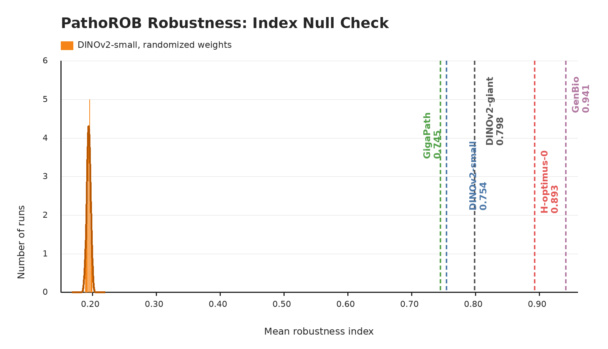

# PathoROB

## Role In Nanopath

`pathorob` is a robustness probe. It contributes one scalar to `mean_probe_score`: the mean of the camelyon and tolkach_esca robustness indices.

## Source

- [bifold-pathomics/PathoROB-camelyon](https://huggingface.co/datasets/bifold-pathomics/PathoROB-camelyon)
- [bifold-pathomics/PathoROB-tolkach_esca](https://huggingface.co/datasets/bifold-pathomics/PathoROB-tolkach_esca)
- Paper/preprint: [Towards Robust Foundation Models for Digital Pathology](https://arxiv.org/abs/2507.17845)

Both are downloaded from Hugging Face by `prepare.py`.

## Data Used

PathoROB measures whether an embedding neighborhood is dominated more by biological class than by non-biological medical-center signatures. Nanopath uses two public PathoROB subsets:

| subset | tissue / organ | biological classes | centers used | patches used |
|---|---|---:|---:|---:|
| camelyon | breast lymph node metastasis | 2 | 5 | 22402 |
| tolkach_esca | esophageal cancer | 6 | 3 | 13800 |

The downloaded Tolkach ESCA parquet has 16,300 patches across four centers, but `probe.py` excludes `VALSET3_TCGA` before scoring, leaving 13,800 used patches. PathoROB is not a supervised train/validation fit in Nanopath, so the train and val columns are not applicable.

## Implementation

`probe.py` embeds every patch in each subset using a no-crop square resize and the frozen backbone. For each patch it concatenates the normalized CLS token with the mean normalized patch-token vector, normalizes the resulting feature, drops same-slide neighbors, and computes the PathoROB-style site-vs-biology neighbor index with fixed `k` values:

- camelyon: `k = 11`
- tolkach_esca: `k = 46`

The implementation counts same-biology/different-center neighbors (`SO`) and different-biology/same-center neighbors (`OS`) among the retained nearest neighbors, then reports `SO / (SO + OS)`. The dataset score is the mean of the two subset indices, so higher means biological structure dominates center structure more strongly.

## Null Distribution Audit

`plot_null_checks.py` generates the figure above. The orange null is a fresh current-code rerun that constructs a new DINOv2-small with randomized weights for each seed before calling `probe.py`: mean 0.194, std 0.003, max 0.199. Fixed checkpoints are shown as vertical references: DINOv2-small 0.754, DINOv2-giant 0.798, GigaPath 0.745, GenBio-PathFM 0.941, and H-optimus-0 0.893.

This is the strongest null check in the suite. Randomized DINOv2-small is tightly clustered near 0.19, while every pretrained reference is far above it, so PathoROB is clearly measuring backbone structure rather than probe-head randomness.

## Difference From Original Usage

The original PathoROB benchmark includes multiple robustness settings and more datasets. Nanopath uses the camelyon and non-TCGA tolkach_esca public subsets, does no supervised head training, and treats the resulting robustness index as one validation-style probe scalar. It should be interpreted differently from the classification probes: this score rewards center-invariant biological neighborhoods, not task accuracy on labeled train/validation splits.
