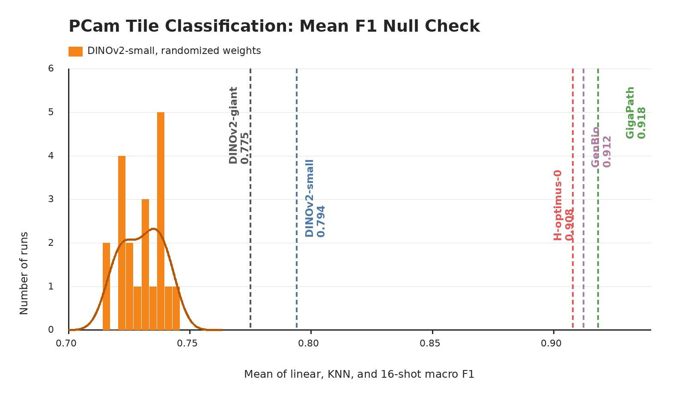

# PCam

## Role In Nanopath

`pcam` is a lymph-node metastasis tile-classification probe derived from PatchCamelyon. It contributes one scalar to `mean_probe_score`: the mean of linear, KNN, and 16-shot SimpleShot validation macro F1.

## Source

- Dataset: [PatchCamelyon](https://patchcamelyon.grand-challenge.org/)
- Benchmark family: [THUNDER](https://mics-lab.github.io/thunder/) tile-classification tasks (`linear_probing`, `knn`, `simple_shot`)
- Upstream source: [Zenodo record 2546921](https://zenodo.org/records/2546921)
- Download used by `prepare.py`: `medarc/nanopath`, under `probes/pcam/`

## Split And Labels

PCam contains 327,680 96x96 color patches extracted from Camelyon lymph-node WSIs, with a binary label for metastatic tumor in the central patch region. PCam does not use a checked-in JSON split. `probe.py` reads the official H5 files and takes deterministic subsets:

| split | source file split | images used |
|---|---|---:|
| train | `train` | 3072 of 262,144 |
| val | `valid` | 768 of 32,768 |

The HF mirror stores only those deterministic train/valid subset H5s. `probe.py` never reads the official test H5 files.

## Implementation

`ClassificationDataset(..., dataset="pcam")` samples fixed train and validation subsets with `PCAM_SUBSET_SEED = 1337`, embeds those images with Nanopath's default transform or the baseline script's explicit `probe.transform_policy`, and fits three heads on cached embeddings:

- AdamW linear probe: LR ∈ {1e-3, 1e-4, 1e-5}, weight decay 1e-4, batch size 64, 200 epochs; report the best val macro F1 across all LR × epoch checkpoints
- cosine KNN: k ∈ {1, 3, 5, 10, 20, 30, 40, 50}, k selected by val F1
- SimpleShot few-shot: 1000 deterministic 16-shot support sets per class, support/query embeddings centered by each support-set mean, class prototypes from class-specific centered support means, cosine nearest-centroid prediction, then per-query majority vote

The dataset score is `mean(linear_val_f1, knn_val_f1, fewshot_val_f1)`. The official test split is not downloaded by the normal probe path and is not part of `mean_probe_score`.

## Null Distribution Audit

`plot_null_checks.py` generates the figure above. The orange null is a fresh current-code rerun that constructs a new DINOv2-small with randomized weights for each seed before calling `probe.py`: mean 0.730, std 0.008, max 0.743. Fixed checkpoints are shown as vertical references: DINOv2-small 0.794, DINOv2-giant 0.775, GigaPath 0.918, GenBio-PathFM 0.912, and H-optimus-0 0.908.

This audit shows a high random-feature floor, likely because PCam's small fixed subset has strong low-level stain and morphology cues. The probe is still usable because pretrained DINOv2 clears the null and pathology-pretrained references are far above it, but small changes near the randomized-weight tail should be treated cautiously.

## Difference From Original Usage

THUNDER lists the full official train/valid/test sets for PCam. Nanopath deliberately uses a small deterministic train/valid subset from those official H5 files so the full 11-dataset probe remains inside the final H100 window. This is a runtime adaptation, not an exact full-sample THUNDER PCam run. Because the random-feature null is high, PCam is best interpreted as a sanity-check metastasis morphology probe where large pathology-pretrained gains matter, not as a sensitive detector of tiny backbone changes.
