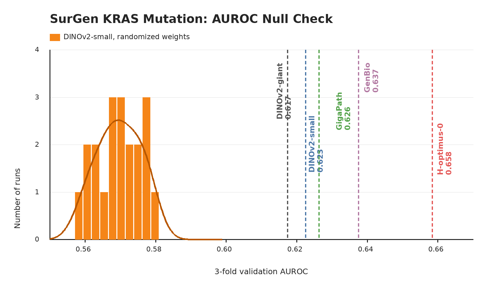

# SurGen

## Role In Nanopath

`surgen` is a colorectal slide-level mutation prediction probe. It contributes one scalar to `mean_probe_score`: validation AUROC for PathoBench SR386 RAS mutation status.

## Source

- Dataset: [PathoBench](https://huggingface.co/datasets/MahmoodLab/Patho-Bench) `sr386_/ras_mutant_binary`, derived from the [SurGen SR386 colorectal cohort](https://github.com/CraigMyles/SurGen-Dataset)
- Default `prepare.py` source: pre-extracted `probes/surgen/` parquet cache in `medarc/nanopath`
- Raw WSI source used to regenerate the mirror: `https://ftp.ebi.ac.uk/biostudies/fire/S-BIAD/285/S-BIAD1285/Files/SR386_WSIs`

## Split And Labels

SurGen is a colorectal cancer WSI resource with survival and molecular annotations; PathoBench exposes SR386 tasks from it, including binary RAS mutation status. Nanopath starts from PathoBench fold 0 for `sr386_/ras_mutant_binary`. PathoBench provides only train/test assignments, so Nanopath runs deterministic stratified 3-fold validation over the fold-0 train slides with seed 1337. The PathoBench fold-0 test slides stay held out and are kept only for provenance. Here, "wildtype" is the negative class and "mutated" is the positive RAS mutation class from PathoBench.

```text
mutated = PathoBench ras_mutant_binary label 1
wildtype = PathoBench ras_mutant_binary label 0
```

| split | slides | labels | cached tiles |
|---|---:|---|---:|
| train pool | 311 | 201 wildtype / 110 mutated | 1,167,089 cached; ~219,505 embedded |
| per-fold train | 207-208 | reused | reused |
| per-fold val | 103-104 | reused | reused |
| test | 78 | 50 wildtype / 28 mutated | 0 |

Only train and val are read by `probe.py`.

## Implementation

`prepare.py` normally downloads the canonical pre-extracted cache from `medarc/nanopath`: 16 `data/surgen-*.parquet` shards, `labels.csv`, and `tiling_version.txt` totaling about 102 GiB. The local regeneration helper `fetch_surgen_from_official_sources()` streams each fold-0 train CZI from EBI BioStudies, extracts a full deterministic 20x, 512 px, 0-overlap tissue grid, writes one resumable parquet under `slides/` per WSI, then concatenates the slide parquets into the HF-mirrored parquet shards. `probe.py` selects up to 768 tiles per slide by taking evenly spaced parquet row groups from the raster-scan tissue order, streams those cached row groups into running slide-level feature means with a no-crop square resize, sweeps balanced `sklearn.linear_model.LogisticRegression(solver="liblinear")` over `C={0.001,0.01,0.1,0.5,1,10,100}` across the three folds, and reports mean validation AUROC at the best mean `C`. The sweep keeps this small-slide, high-dimensional probe from depending too much on one regularization setting while preserving PathoBench's balanced linear-probe convention; streaming avoids materializing the ~220k selected JPEGs and pooled tile features in RAM.

## Null Distribution Audit



`plot_null_checks.py` generates the figure above. The orange null is a fresh current-code rerun that constructs a new DINOv2-small with randomized weights for each seed before calling `probe.py`: mean 0.570, std 0.006, max 0.579. Fixed checkpoints are shown as vertical references: DINOv2-small 0.623, DINOv2-giant 0.617, GigaPath 0.626, GenBio-PathFM 0.637, and H-optimus-0 0.658.

This audit is acceptable but not low-floor. Randomized weights recover a real amount of signal, so SurGen should not be interpreted as chance-calibrated around 0.5. The fixed pretrained references still clear the randomized null by a meaningful margin, with H-optimus-0 separating best, but small AUROC changes near the null tail should be treated cautiously.

## Difference From Original Usage

This is PathoBench-derived but not a full PathoBench test-fold evaluation. PathoBench standardizes the SR386 RAS mutation labels, train/test split, sample column, and AUROC metric, and its tutorial runs linear probing on mean-pooled Trident features extracted from a 20x, 512 px, 0-overlap tissue grid with no bag-size cap. Nanopath follows that tiling shape in `prepare.py`, but `probe.py` uses a deterministic 768-tile sub-bag so the final probe fits the small-model H100 window. PathoBench's canonical fold-0 test split is deliberately not scored in `mean_probe_score`, Nanopath uses repeated validation carved out of PathoBench fold-0 train for fast iteration, and the tissue mask is a lightweight deterministic thumbnail mask rather than Trident HEST segmentation.

The HF cache is not a new data source or a changed protocol; it is the output of the official-source extraction above. It exists because downloading and tiling hundreds of multi-GB CZI files from EBI takes multiple hours and is a poor default setup experience.
