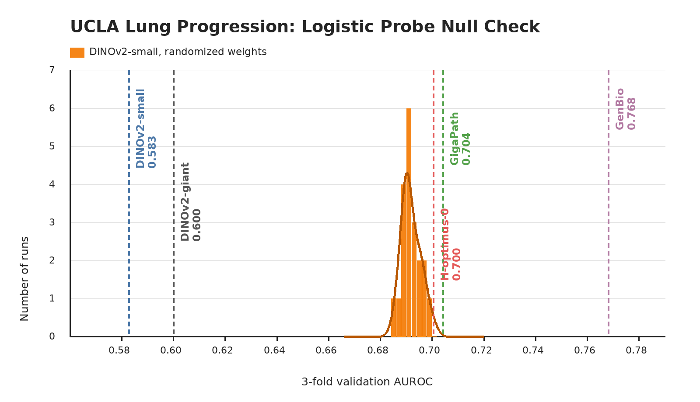

# UCLA Lung

## Role In Nanopath

`ucla_lung` is a lung slide-level progression/regression classification probe. It contributes one scalar to `mean_probe_score`: validation AUROC from a balanced logistic linear probe on mean-pooled slide embeddings.

## Source

- Task metadata: [PathoBench](https://huggingface.co/datasets/MahmoodLab/Patho-Bench/tree/main/ucla_lung) `ucla_lung/progression_regression`
- Raw images: [IDR idr0082 Pennycuick lesions](https://idr.openmicroscopy.org/search/?query=Name:idr0082)
- Upstream raw image base: `https://ftp.ebi.ac.uk/pub/databases/IDR/idr0082-pennycuick-lesions/20200517-ftp`
- Download used by `prepare.py`: pre-extracted `tiles.parquet` in `medarc/nanopath`, under `probes/ucla_lung/`

## Split And Tiles

IDR idr0082 contains H&E imaging of 112 pre-invasive lung squamous-cell carcinoma in-situ lesions from the Pennycuick et al. immune-surveillance study. PathoBench turns this into a binary progression/regression slide task. Nanopath uses `ucla_lung.json`, derived from PathoBench fold 0. The 90 fold-0 train slides are evaluated with deterministic stratified 3-fold validation; the 22 fold-0 test slides remain provenance metadata and are not read by `probe.py`. Case ids are unique across train, val, and test.

| split | slides | cached tiles |
|---|---:|---:|
| train pool | 90 | full 20x/512 tissue grid |
| per-fold train | 60 | reused |
| per-fold val | 30 | reused |
| test | 22 | not cached |

Only train and val are read by `probe.py`.

Within the train pool, label 0 has 35 slides and label 1 has 55 slides. The held-out provenance test split has 9 label-0 slides and 13 label-1 slides.

## Implementation

`prepare.py` downloads the pre-extracted deterministic 20x, 512 px, 0-overlap tissue grid as `tiles.parquet`. A `pathobench_20x_512_v1` marker makes older capped or differently tiled caches fail verification. `probe.py` embeds every cached tile once with a no-crop square resize, mean-pools tile embeddings per slide, then for each fold fits a balanced logistic linear probe (`sklearn.linear_model.LogisticRegression`, `class_weight="balanced"`, `max_iter=5000`) over `C ∈ {0.001, 0.01, 0.1, 0.5, 1.0, 10.0, 100.0}`, averages val AUROC across the three folds at each `C`, and reports the best mean.

## Null Distribution Audit

`plot_null_checks.py` generates the figure above. The orange null is a fresh current-code rerun that constructs a new DINOv2-small with randomized weights for each seed before calling `probe.py`: mean 0.692, std 0.004, max 0.700. Fixed checkpoints are shown as vertical references: DINOv2-small 0.583, DINOv2-giant 0.600, GigaPath 0.704, H-optimus-0 0.700, and GenBio-PathFM 0.768.

This audit is a caution flag. The randomized-weight null lands far above chance and above the natural-image DINOv2 checkpoints, so `ucla_lung` progression is not a clean representation-quality readout in isolation. It may still separate some pathology-pretrained baselines, especially GenBio-PathFM, but small improvements near the random null should be treated as unstable benchmark noise rather than strong evidence.

## Difference From Original Usage

PathoBench reports macro one-vs-rest AUROC for this task; with fold 0's two-class labels this equals binary AUROC. PathoBench runs linear probing on mean-pooled Trident features; Nanopath's balanced logistic linear probe matches that head class on custom-backbone features. Nanopath uses repeated train-derived validation from fold 0 and follows the uncapped Trident-style patch-grid contract for slide pooling; it does not report the PathoBench test-fold score. The tissue mask is a lightweight deterministic thumbnail mask rather than Trident HEST segmentation. The random-weight null is high, so this dataset should be treated as a weak standalone signal and a useful stress test for shortcut sensitivity rather than as a chance-calibrated binary classifier.
